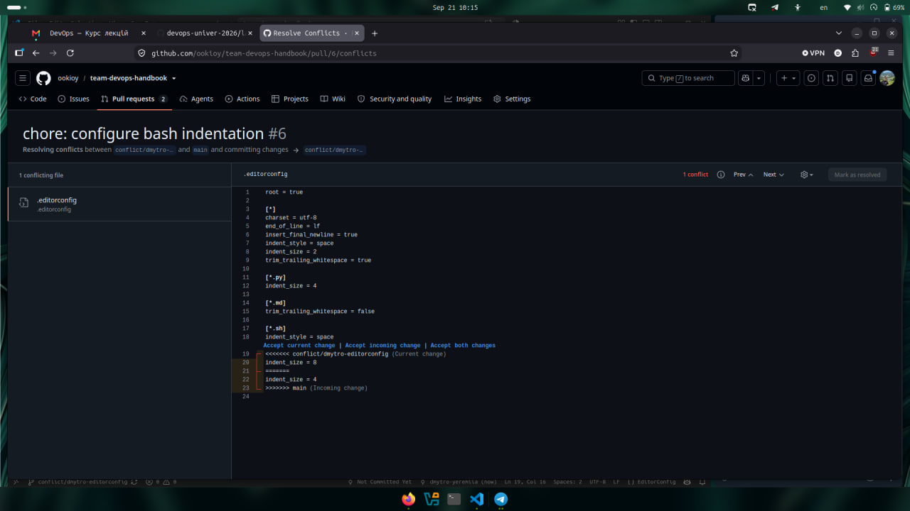
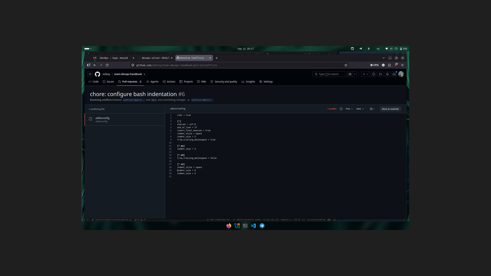
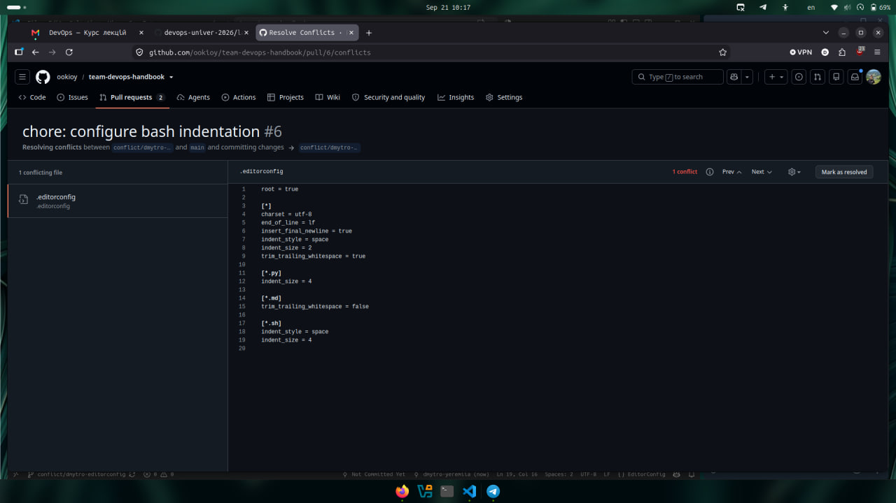

# Конфлікт злиття .editorconfig

## Причина конфлікту

Два учасники команди незалежно змінили налаштування відступів для Bash-файлів у `.editorconfig`.

У першій гілці було вибрано:

```ini
[*.sh]
indent_style = space
indent_size = 4
```

У другій гілці:

```ini
[*.sh]
indent_style = space
indent_size = 8
```

Після злиття першої гілки в `main` Pull Request другої гілки отримав merge conflict, оскільки обидва учасники змінили значення indent_size для одного типу файлів.

## Конфлікт Git

Git показав два різні варіанти одного параметра:

```text
<<<<<<< conflict/dmytro-editorconfig
indent_size = 8
=======
indent_size = 4
>>>>>>> main
```

## Помилкове вирішення

Помилковим способом є механічне збереження обох змін:

```ini
[*.sh]
indent_style = space
indent_size = 8
indent_size = 4
```

Після такого вирішення маркери Git-конфлікту відсутні, а файл зовні виглядає як звичайна конфігурація. Проте параметр `indent_size` визначений двічі з різними значеннями.

Це небезпечно, оскільки одне значення може перевизначити інше. У результаті фактична поведінка редактора може не відповідати очікуванням одного з учасників команди.

## Правильне вирішення

Після аналізу конфлікту команда повинна вибрати одне узгоджене значення.

Було залишено:

```ini
[*.sh]
indent_style = space
indent_size = 4
```

Цей варіант є правильним, оскільки параметр `indent_size` визначений однозначно, дублювання відсутнє, а всі учасники команди отримують однакові правила форматування Bash-файлів.

## Висновок

Конфлікт у структурованому конфігураційному файлі небезпечніший за звичайний текстовий конфлікт. Формальне видалення маркерів Git ще не означає правильного вирішення: файл може залишатися синтаксично коректним, але містити неправильні або суперечливі налаштування.

Рисунок 1 — Конфлікт злиття у файлі .editorconfig через різні значення indent_size.


Рисунок 2 — Помилкове вирішення конфлікту шляхом збереження обох значень indent_size.


Рисунок 3 — Правильне вирішення конфлікту з одним узгодженим значенням indent_size = 4.

